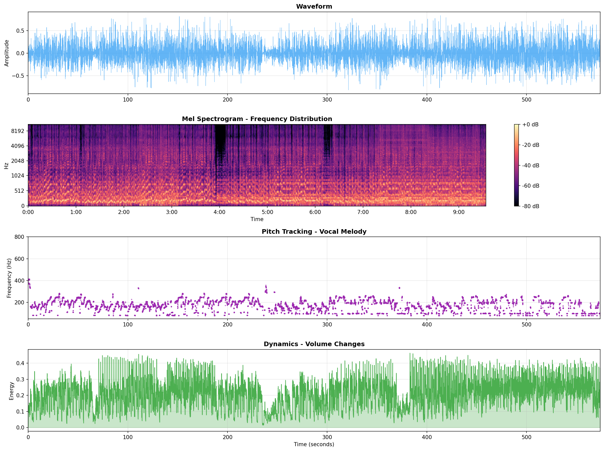
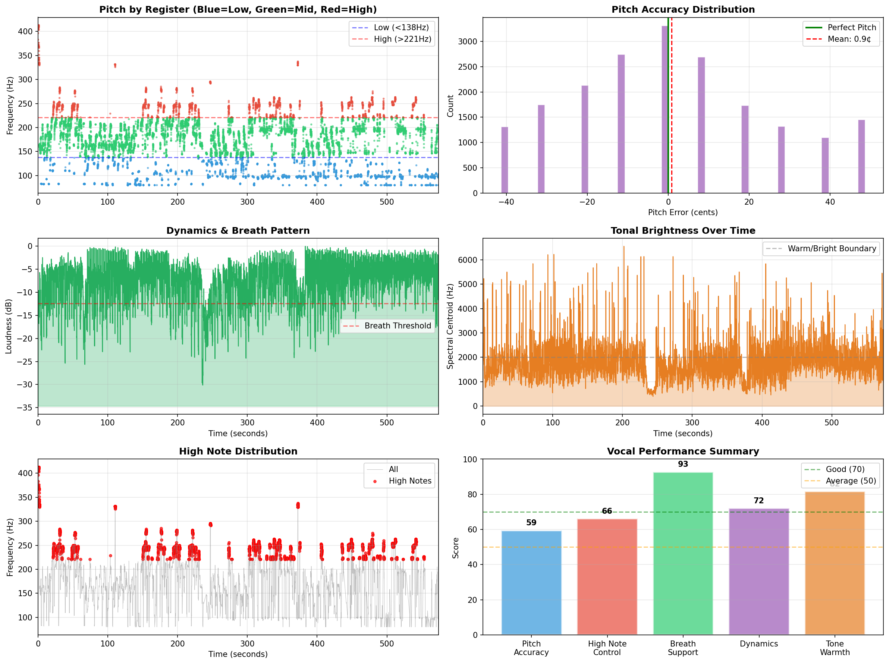
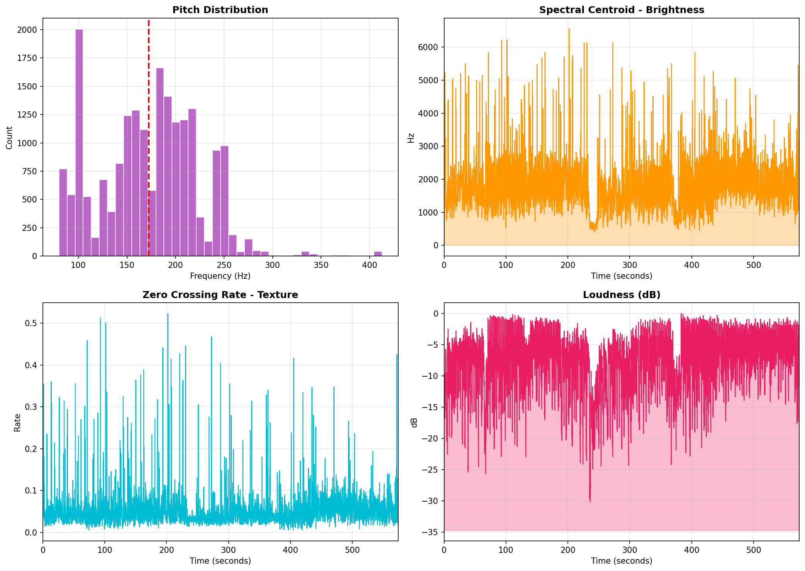

# Worship Vocal AI Coach - How It Works

## 🎯 System Overview

```
┌─────────────────────────────────────────────────────────────────────────────┐
│                        WORSHIP VOCAL AI COACH                                │
│                   찬양 인도자를 위한 AI 보컬 코칭                              │
└─────────────────────────────────────────────────────────────────────────────┘

    ┌──────────────┐         ┌──────────────┐
    │   🎵 Song A   │         │   🎵 Song B   │
    │  (느린 곡)    │         │  (빠른 곡)    │
    │  Slow Ballad │         │  Fast Upbeat │
    └──────┬───────┘         └───────┬──────┘
           │                         │
           ▼                         ▼
    ┌─────────────────────────────────────────┐
    │          🔊 AUDIO INPUT                  │
    │   • File Upload (MP3, WAV, M4A)         │
    │   • YouTube URL + Time Range            │
    └────────────────┬────────────────────────┘
                     │
                     ▼
    ┌─────────────────────────────────────────┐
    │       🎭 VOCAL SEPARATION (Optional)     │
    │   • Demucs / Spleeter                   │
    │   • Isolate vocals from background      │
    └────────────────┬────────────────────────┘
                     │
                     ▼
    ┌─────────────────────────────────────────┐
    │       📊 AUDIO FEATURE EXTRACTION        │
    │                                          │
    │   ┌─────────┐ ┌─────────┐ ┌─────────┐   │
    │   │  Pitch  │ │Dynamics │ │ Timbre  │   │
    │   │ 음정분석 │ │다이나믹 │ │ 음색    │   │
    │   └─────────┘ └─────────┘ └─────────┘   │
    │   ┌─────────┐ ┌─────────┐ ┌─────────┐   │
    │   │Vibrato  │ │ Rhythm  │ │ Breath  │   │
    │   │비브라토 │ │ 리듬    │ │ 호흡    │   │
    │   └─────────┘ └─────────┘ └─────────┘   │
    │                                          │
    │   🔧 Powered by: librosa                 │
    └────────────────┬────────────────────────┘
                     │
                     ▼
    ┌─────────────────────────────────────────┐
    │      🧬 DUAL-CORE ANALYSIS ENGINE        │
    │                                          │
    │   Song A ──┐     ┌── Song B             │
    │            │     │                       │
    │            ▼     ▼                       │
    │      ┌─────────────────┐                │
    │      │   COMPARISON    │                │
    │      │   교차 비교      │                │
    │      └────────┬────────┘                │
    │               │                          │
    │    ┌──────────┼──────────┐              │
    │    ▼          ▼          ▼              │
    │ ┌──────┐ ┌────────┐ ┌────────┐         │
    │ │공통   │ │공통    │ │ 스타일 │         │
    │ │강점   │ │약점    │ │차이점  │         │
    │ └──────┘ └────────┘ └────────┘         │
    └────────────────┬────────────────────────┘
                     │
                     ▼
    ┌─────────────────────────────────────────┐
    │        🤖 AI ANALYSIS (Claude API)       │
    │                                          │
    │   • Vocal Persona Generation            │
    │   • THE SIGNATURE (필살기)              │
    │   • THE HIDDEN ENEMY (숨은 약점)        │
    │   • Personalized Coaching               │
    │   • Song Recommendations                │
    └────────────────┬────────────────────────┘
                     │
                     ▼
    ┌─────────────────────────────────────────┐
    │          📋 RESULT OUTPUT                │
    │                                          │
    │  ┌─────────────────────────────────┐    │
    │  │  🎭 Vocal Persona               │    │
    │  │  "감성의 스토리텔러"             │    │
    │  └─────────────────────────────────┘    │
    │                                          │
    │  ┌─────────────────────────────────┐    │
    │  │  📊 Vocal MBTI: ST/WL/PA/IN/JO/SO│   │
    │  └─────────────────────────────────┘    │
    │                                          │
    │  ┌─────────────────────────────────┐    │
    │  │  🧬 6D Vocal DNA                 │    │
    │  │  Warmth│Power│Stability│        │    │
    │  │  Expression│Groove│Intimacy     │    │
    │  └─────────────────────────────────┘    │
    │                                          │
    │  ┌─────────────────────────────────┐    │
    │  │  ⭐ 5-Dimension Radar Chart     │    │
    │  │  감성│음색│리듬│발성│리딩       │    │
    │  └─────────────────────────────────┘    │
    └─────────────────────────────────────────┘
```

---

## 📊 Analysis Pipeline Detail

```
┌─────────────────────────────────────────────────────────────────────┐
│                    AUDIO FEATURE EXTRACTION                          │
│                       오디오 특징 추출                                │
└─────────────────────────────────────────────────────────────────────┘

    Audio File (.mp3, .wav)
           │
           ▼
    ┌──────────────────┐
    │  librosa.load()  │  ──────▶  Sample Rate: 22050 Hz
    └────────┬─────────┘
             │
    ┌────────┴────────────────────────────────────────────┐
    │                                                      │
    ▼                    ▼                    ▼            ▼
┌────────┐        ┌────────────┐       ┌─────────┐   ┌─────────┐
│ PITCH  │        │  DYNAMICS  │       │ TIMBRE  │   │ RHYTHM  │
│ 음정    │        │  다이나믹   │       │ 음색    │   │ 리듬    │
└────┬───┘        └─────┬──────┘       └────┬────┘   └────┬────┘
     │                  │                   │             │
     ▼                  ▼                   ▼             ▼
• avg_pitch_hz     • dynamic_range_db   • spectral_    • tempo_bpm
• pitch_range      • energy_variance      centroid_hz  • rhythm_offset
• pitch_accuracy   • climax_intensity  • warmth_score • beat_sync
  (cents)
• pitch_stability
• high_note_
  stability
• flat/sharp_
  tendency
```

---

## 🎭 Vocal MBTI Classification

```
┌─────────────────────────────────────────────────────────────────────┐
│                      6 VOCAL MBTI TYPES                              │
│                       보컬 MBTI 6가지 유형                            │
└─────────────────────────────────────────────────────────────────────┘

┌─────────────┐  ┌─────────────┐  ┌─────────────┐
│     ST      │  │     WL      │  │     PA      │
│ Storyteller │  │Worship Lead │  │ Passionate  │
│ 스토리텔러  │  │  워십리더   │  │   열정가    │
│             │  │             │  │             │
│ 📖 말하듯   │  │ ⚓ 안정적   │  │ 🔥 폭발적   │
│ 전하는      │  │ 리딩        │  │ 감정표현    │
│ 진정성      │  │             │  │             │
└─────────────┘  └─────────────┘  └─────────────┘

┌─────────────┐  ┌─────────────┐  ┌─────────────┐
│     IN      │  │     JO      │  │     SO      │
│  Intimate   │  │   Joyful    │  │   Soulful   │
│ 인티메이트  │  │   조이풀    │  │   소울풀    │
│             │  │             │  │             │
│ 🕊️ 속삭이듯 │  │ ☀️ 밝고     │  │ 🎷 깊은     │
│ 친밀한      │  │ 경쾌한      │  │ 영혼의 울림 │
│             │  │             │  │             │
└─────────────┘  └─────────────┘  └─────────────┘
```

---

## 🧬 6-Dimension Vocal DNA

```
                    ┌─────────────────────────────────────┐
                    │        6D VOCAL DNA PROFILE          │
                    │          보컬 DNA 6차원              │
                    └─────────────────────────────────────┘

                              Warmth (따뜻함)
                                   ▲
                                   │ 85
                          ╱────────┴────────╲
                        ╱                    ╲
          Intimacy    ╱          🎤           ╲    Power
          (친밀감)   │           YOU           │   (파워)
            72 ◀─────┤                         ├─────▶ 65
                     │                         │
                      ╲                       ╱
                        ╲                   ╱
                          ╲───────┬───────╱
                                  │
                                  ▼ 78
                             Stability
                              (안정성)

          ┌─────────────────────────────────────────────┐
          │                                             │
          │   Expression (표현력) ◀────────▶ 70        │
          │                                             │
          │   Groove (그루브) ◀─────────────▶ 88       │
          │                                             │
          └─────────────────────────────────────────────┘
```

---

## ⭐ 5-Dimension Radar Chart

```
                              감성 (Emotion)
                                   ▲
                                  /│\
                                 / │ \
                                /  │  \   85
                               /   │   \
                              /    │    \
                             /     │     \
              리딩          /      │      \         음색
            (Leadership)◀──/───────┼───────\──▶ (Timbre)
                78        /        │        \     72
                         /         │         \
                        /          │          \
                       /           │           \
                      /            │            \
                     ▼             │             ▼
                                   │
                    리듬 ◀─────────┴─────────▶ 발성
                  (Rhythm)    91         (Technique)
                                              67
```

---

## 🔄 User Flow

```
┌─────────────────────────────────────────────────────────────────────┐
│                         USER JOURNEY                                 │
│                         사용자 여정                                   │
└─────────────────────────────────────────────────────────────────────┘

    👤 User
       │
       ▼
┌──────────────┐    ┌──────────────┐
│ 단일 분석    │ OR │ 이중 분석    │
│ Single Mode  │    │ Dual Mode    │
└──────┬───────┘    └──────┬───────┘
       │                   │
       ▼                   ▼
┌──────────────┐    ┌──────────────┐
│ Upload 1 Song│    │Upload 2 Songs│
│ 노래 1개     │    │ 노래 2개     │
│              │    │ (느린+빠른)  │
└──────┬───────┘    └──────┬───────┘
       │                   │
       └─────────┬─────────┘
                 │
                 ▼
       ┌─────────────────┐
       │  ⏳ Processing   │
       │  분석 중...      │
       │  (2-5 minutes)  │
       └────────┬────────┘
                │
                ▼
       ┌─────────────────┐
       │   📊 Results    │
       │   결과 확인      │
       └────────┬────────┘
                │
    ┌───────────┼───────────┬───────────┬───────────┐
    ▼           ▼           ▼           ▼           ▼
┌────────┐ ┌────────┐ ┌────────┐ ┌────────┐ ┌────────┐
│🎭 코칭 │ │📊 기술 │ │🎵 추천 │ │📋 MBTI│ │📥 다운 │
│ Coach  │ │Analysis│ │ Songs  │ │ Type  │ │Download│
└────────┘ └────────┘ └────────┘ └────────┘ └────────┘
```

---

## 📸 Screenshots

### Audio Dashboard


### Vocal Deep Analysis


### Vocal Detail


---

## 🛠️ Tech Stack Overview

```
┌─────────────────────────────────────────────────────────────────────┐
│                        TECHNOLOGY STACK                              │
└─────────────────────────────────────────────────────────────────────┘

┌──────────────────────────────────────────────────────────────────────┐
│                           FRONTEND                                    │
│  ┌──────────────┐  ┌──────────────┐  ┌──────────────┐              │
│  │  Streamlit   │  │   Plotly     │  │  Matplotlib  │              │
│  │  Web UI      │  │   Charts     │  │   Graphs     │              │
│  └──────────────┘  └──────────────┘  └──────────────┘              │
└──────────────────────────────────────────────────────────────────────┘
                                │
                                ▼
┌──────────────────────────────────────────────────────────────────────┐
│                        AUDIO PROCESSING                               │
│  ┌──────────────┐  ┌──────────────┐  ┌──────────────┐              │
│  │   librosa    │  │   Demucs     │  │   yt-dlp     │              │
│  │  Analysis    │  │  Separation  │  │  YouTube     │              │
│  └──────────────┘  └──────────────┘  └──────────────┘              │
└──────────────────────────────────────────────────────────────────────┘
                                │
                                ▼
┌──────────────────────────────────────────────────────────────────────┐
│                         AI / ML LAYER                                 │
│  ┌──────────────────────────────────────────────────────────┐       │
│  │                   Claude API (Anthropic)                  │       │
│  │                   Vocal Coaching & Insights               │       │
│  └──────────────────────────────────────────────────────────┘       │
└──────────────────────────────────────────────────────────────────────┘
                                │
                                ▼
┌──────────────────────────────────────────────────────────────────────┐
│                           EXPORT                                      │
│  ┌──────────────┐  ┌──────────────┐                                 │
│  │    fpdf2     │  │   Pillow     │                                 │
│  │  PDF Report  │  │ Share Image  │                                 │
│  └──────────────┘  └──────────────┘                                 │
└──────────────────────────────────────────────────────────────────────┘
```

---

<p align="center">
<b>Worship Vocal AI Coach</b><br>
찬양 인도자들의 성장을 돕는 AI 보컬 코치
</p>
